# Realtime Notes API

A Kubernetes-native service that delivers real-time, multi-user Markdown note editing plus semantic AI search as a turnkey backend component.

## UI Demo


*Real-time collaborative markdown editor with live preview, showing enterprise-grade content with ASCII diagrams, performance metrics, and rich formatting*

## Features

- Real-time CRDT collaboration via WebSocket
- CRUD & versioned fetch of Markdown notes
- Vector search (FAISS) scoped to tenant
- Multiple API surfaces: REST, gRPC, and WebSocket
- Authentication with API Keys and OAuth 2.1
- RBAC with row-level isolation
- Rate limiting & quotas
- Usage metering & billing

## Architecture Overview

The Realtime Notes API is built as a modern, scalable microservice with multiple API interfaces and real-time collaboration capabilities.

```mermaid
graph TB
    %% External Clients
    Client[🖥️ Web Client]
    Mobile[📱 Mobile App]
    CLI[💻 CLI Tool]

    %% API Gateway
    Gateway[⚖️ Load Balancer<br/>Kubernetes Ingress]

    %% API Layer
    REST[🌐 REST API<br/>Port 8000<br/>FastAPI]
    WS[🔌 WebSocket API<br/>Real-time Collaboration]
    GRPC[⚡ gRPC API<br/>High Performance]

    %% Auth & Security
    Auth[🔐 Authentication<br/>API Keys & OAuth 2.1]
    RateLimit[🚦 Rate Limiting<br/>Redis Token Bucket]

    %% Core Services
    Router[🎯 FastAPI Routers]
    NotesService[📝 Notes Service<br/>CRUD & Versioning]
    SearchService[🔍 Search Service<br/>Vector Embeddings]
    CollabService[👥 Collaboration<br/>WebSocket Manager]

    %% Data Storage
    PostgresDB[(🐘 PostgreSQL<br/>Primary Database)]
    Redis[(📦 Redis<br/>Pub/Sub & Caching)]
    FAISS[(🧠 FAISS Index<br/>Vector Search)]

    %% Infrastructure
    Docker[🐳 Docker Compose<br/>Local Development]
    K8s[☸️ Kubernetes<br/>Production Deployment]

    %% Connections
    Client --> Gateway
    Mobile --> Gateway
    CLI --> Gateway

    Gateway --> REST
    Gateway --> WS
    Gateway --> GRPC

    REST --> Auth
    WS --> Auth
    GRPC --> Auth

    Auth --> RateLimit
    RateLimit --> Router

    Router --> NotesService
    Router --> SearchService
    Router --> CollabService

    NotesService --> PostgresDB
    SearchService --> FAISS
    CollabService --> Redis

    REST -.-> Docker
    Docker -.-> K8s

    %% Styling - Dark mode friendly colors
    classDef client fill:#1e3a8a,stroke:#3b82f6,stroke-width:2px,color:#ffffff
    classDef api fill:#134e4a,stroke:#14b8a6,stroke-width:2px,color:#ffffff
    classDef service fill:#365314,stroke:#84cc16,stroke-width:2px,color:#ffffff
    classDef storage fill:#92400e,stroke:#f59e0b,stroke-width:2px,color:#ffffff
    classDef infra fill:#7c2d12,stroke:#f97316,stroke-width:2px,color:#ffffff
    classDef auth fill:#581c87,stroke:#a855f7,stroke-width:2px,color:#ffffff

    class Client,Mobile,CLI client
    class REST,WS,GRPC api
    class NotesService,SearchService,CollabService service
    class PostgresDB,Redis,FAISS storage
    class Docker,K8s,Gateway infra
    class Auth,RateLimit,Router auth
```



### Key Components

| Component          | Purpose                          | Technology                |
| ------------------ | -------------------------------- | ------------------------- |
| **REST API**       | Standard HTTP CRUD operations    | FastAPI                   |
| **WebSocket API**  | Real-time collaborative editing  | WebSocket + JSON Patch    |
| **gRPC API**       | High-performance binary protocol | gRPC + Protocol Buffers   |
| **Authentication** | API key & OAuth 2.1 auth         | JWT + Redis               |
| **Rate Limiting**  | Per-organization quotas          | Redis token bucket        |
| **Vector Search**  | Semantic similarity search       | FAISS + embeddings        |
| **Real-time Sync** | Multi-user collaboration         | WebSocket + Redis pub/sub |
| **Database**       | Primary data storage             | PostgreSQL                |
| **Caching**        | Session & pub/sub                | Redis                     |

### Data Flow Examples

**Note Creation:**

1. Client sends `POST /v1/notes` with API key
2. Authentication validates key and gets organization
3. Rate limiter checks request quotas
4. Note is saved to PostgreSQL with versioning
5. Content is vectorized and indexed in FAISS
6. Response returned with note ID

**Real-time Collaboration:**

1. Multiple clients connect to `WebSocket /ws/notes/{id}`
2. Client sends JSON patch with changes
3. Server applies patch and updates PostgreSQL
4. Change broadcast to all connected clients via Redis
5. Clients receive and apply patches in real-time

**Semantic Search:**

1. Client sends search query to `POST /v1/search`
2. Query text converted to vector embedding
3. FAISS performs similarity search within organization
4. Results ranked by semantic relevance score
5. Note IDs returned with similarity scores

## Quick Start

### Prerequisites

- Kubernetes 1.28+ cluster (kind, minikube, or any managed K8s)
- Helm v3
- kubectl

### Installation

```bash
# Clone the repository
git clone https://github.com/ShlinBrian/Realtime_Note_API
cd realtime-note-api

# Install with Helm
helm install realtime-notes ./helm/realtime-notes
```

### Using the API

```bash
# Get API key
export API_KEY=$(kubectl get secret realtime-note-api-keys -o jsonpath='{.data.admin-key}' | base64 -d)

# Create a note
curl -X POST "https://your-cluster-ip/v1/notes" \
  -H "x-api-key: $API_KEY" \
  -H "Content-Type: application/json" \
  -d '{"title": "My First Note", "content_md": "# Hello World\n\nThis is a test note."}'
```

## Local Development with Docker Compose

The easiest way to run the application locally is using Docker Compose:

```bash
# Using Make
make docker-up

# Or using Docker Compose directly
docker compose up -d
```

Once the services are running:

1. Access the API at http://localhost:8000
2. API documentation is available at http://localhost:8000/docs
3. The initial API key is generated and saved in `local_api_key.txt`
4. PgAdmin is available at http://localhost:5050 (login: admin@example.com / admin)

### Testing the API Locally

```bash
# Get the API key
API_KEY=$(cat local_api_key.txt | grep -oP 'API_KEY=\K.*')

# Create a note
curl -X POST "http://localhost:8000/v1/notes" \
  -H "x-api-key: $API_KEY" \
  -H "Content-Type: application/json" \
  -d '{"title": "My First Note", "content_md": "# Hello World\n\nThis is a test note."}'
```

## Development

You have two options for setting up your development environment:

### Option 1: Using conda (recommended for FAISS support)

```bash
# Create and activate conda environment
conda create --name realtime-note-api python=3.11
conda activate realtime-note-api

# Install FAISS via conda
conda install -c conda-forge faiss-cpu

# Install dependencies
make install

# Generate gRPC code (required before running the API)
make generate-grpc

# Run the API in development mode
make api-dev
```

### Option 2: Using pip with venv

```bash
# Create and activate virtual environment
python -m venv venv
source venv/bin/activate

# Install dependencies
make install

# Generate gRPC code (required before running the API)
make generate-grpc

# Run tests
make test

# Run the API in development mode
make api-dev
```

### Using Make

The project includes a Makefile with useful commands for development:

```bash
# Show all available commands
make help

# Run the API server
make api-run

# Run the API server in development mode with auto-reload
make api-dev

# Run only the database services
make db-run

# Start all Docker services
make docker-up

# View Docker logs
make docker-logs

# Stop Docker services
make docker-down

# Install dependencies
make install

# Generate gRPC code from proto files
make generate-grpc

# Run tests (comprehensive test suite with 80% coverage)
make test

# Run unit tests only
make test-unit

# Run integration tests only
make test-integration

# Generate detailed HTML coverage report
make test-coverage

# Quick test run for development
make test-quick

# Verbose test output for debugging
make test-verbose

# Clean up temporary files and volumes
make clean
```

### Helper Script

The `run_local.sh` script provides several useful commands:

```bash
# Install dependencies
./run_local.sh install

# Start Docker services
./run_local.sh start

# View logs
./run_local.sh logs

# Get API key
./run_local.sh key

# Stop services
./run_local.sh stop

# Clean up everything
./run_local.sh clean
```

## Documentation

- **📖 [Complete API Documentation](docs/api_documentation.md)** - Full REST, WebSocket, and gRPC API reference
- **🏗️ [Architecture Deep Dive](docs/architecture_flowchart.md)** - Detailed system architecture with diagrams
- **🔐 [Authentication Guide](docs/authentication_guide.md)** - API keys, OAuth 2.1, and security best practices
- **🔌 [WebSocket API Guide](docs/websocket_api.md)** - Real-time collaboration and JSON patch operations
- **🌐 [Interactive API Docs](http://localhost:8000/docs)** - Swagger UI (when running locally)

### Quick Reference

```bash
# API Endpoints
GET    /v1/notes           # List notes
POST   /v1/notes           # Create note
GET    /v1/notes/{id}      # Get note
PUT    /v1/notes/{id}      # Update note
DELETE /v1/notes/{id}      # Delete note
POST   /v1/search          # Search notes

# WebSocket
WS     /ws/notes/{id}      # Real-time collaboration

# Authentication
POST   /v1/api-keys        # Create API key
GET    /v1/api-keys        # List API keys
DELETE /v1/api-keys/{id}   # Delete API key
```

## License

MIT
