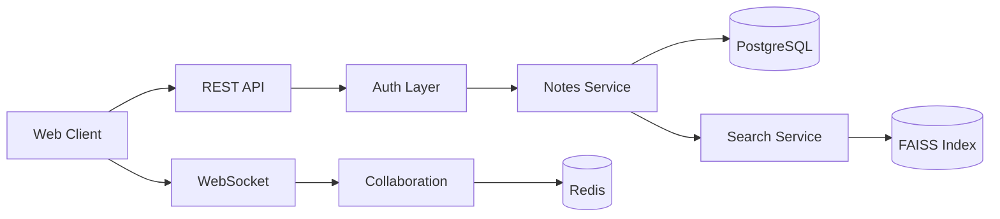
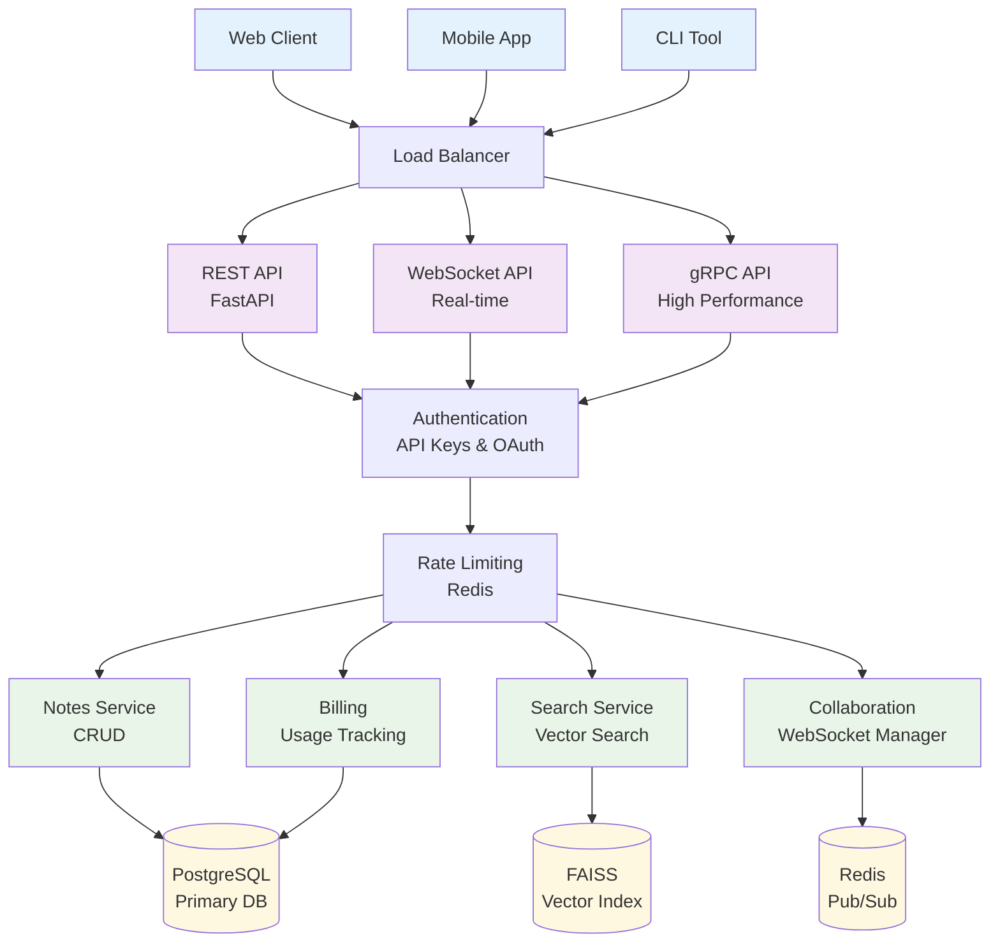
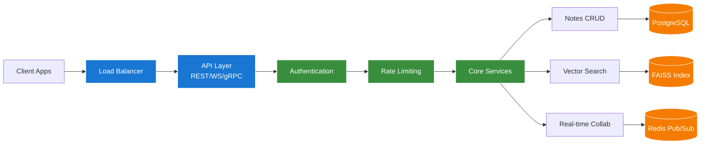
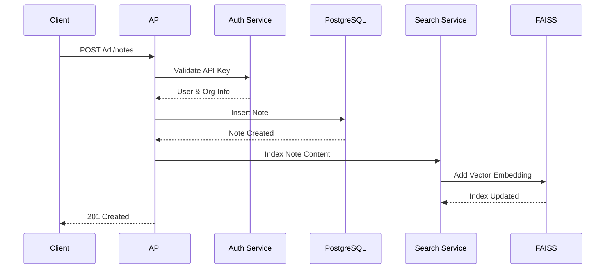
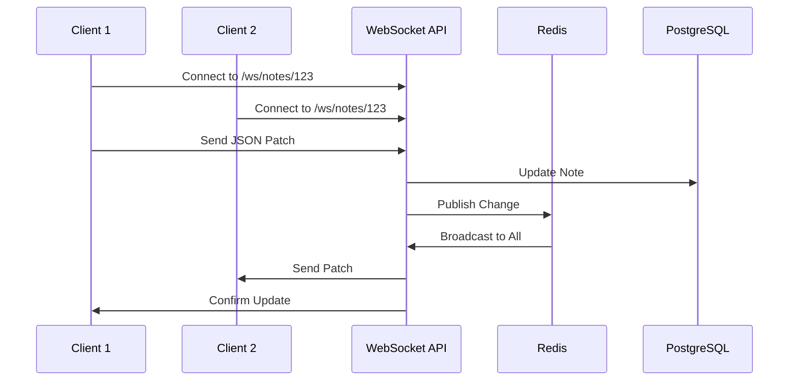

# Realtime Notes API - Architecture Flow Chart

## System Overview

```mermaid
graph TB
    %% External Clients
    Client[🖥️ Web Client]
    Mobile[📱 Mobile App]
    IoT[🤖 IoT Device]
    CLI[💻 CLI Tool]

    %% Load Balancer / Gateway
    LB[⚖️ Load Balancer<br/>Kubernetes Ingress]

    %% API Surfaces
    REST[🌐 REST API<br/>Port 8000<br/>FastAPI]
    WS[🔌 WebSocket API<br/>/ws/notes/note_id<br/>Real-time Collaboration]
    GRPC[⚡ gRPC API<br/>Port 50051<br/>High Performance]

    %% Authentication & Authorization
    Auth[🔐 Authentication Layer<br/>API Keys & OAuth 2.1]
    RateLimit[🚦 Rate Limiting<br/>Redis Token Bucket<br/>Per Organization]

    %% Core Application Layer
    Router[🎯 FastAPI Routers<br/>Notes | Search | Auth | Admin | API Keys]

    %% Business Logic Services
    NotesService[📝 Notes Service<br/>CRUD & Versioning]
    SearchService[🔍 Search Service<br/>Vector Embeddings]
    CollabService[👥 Collaboration Service<br/>WebSocket Manager]
    BillingService[💰 Billing Service<br/>Usage Tracking]

    %% Data Storage Layer
    PostgresDB[(🐘 PostgreSQL<br/>Primary Database<br/>Notes & Users)]
    Redis[(📦 Redis<br/>Pub/Sub & Rate Limiting<br/>WebSocket Scaling)]
    FAISS[(🧠 FAISS Index<br/>Vector Search<br/>Semantic Similarity)]

    %% External Services
    Embedding[🤖 Embedding Model<br/>Text to Vector<br/>384 Dimensions]

    %% Infrastructure
    Docker[🐳 Docker Compose<br/>Local Development]
    K8s[☸️ Kubernetes<br/>Production Deployment<br/>Helm Charts]

    %% Flow Connections
    Client --> LB
    Mobile --> LB
    IoT --> LB
    CLI --> LB

    LB --> REST
    LB --> WS
    LB --> GRPC

    REST --> Auth
    WS --> Auth
    GRPC --> Auth

    Auth --> RateLimit
    RateLimit --> Router

    Router --> NotesService
    Router --> SearchService
    Router --> CollabService
    Router --> BillingService

    %% WebSocket Flow
    WS --> CollabService
    CollabService --> Redis
    Redis --> WS

    %% Search Flow
    SearchService --> FAISS
    SearchService --> Embedding
    NotesService --> Embedding
    Embedding --> FAISS

    %% Data Layer
    NotesService --> PostgresDB
    Auth --> PostgresDB
    BillingService --> PostgresDB

    CollabService --> Redis
    RateLimit --> Redis

    %% Deployment
    REST -.-> Docker
    Docker -.-> K8s

    %% Styling
    classDef client fill:#e1f5fe
    classDef api fill:#f3e5f5
    classDef auth fill:#fff3e0
    classDef service fill:#e8f5e8
    classDef storage fill:#fff8e1
    classDef infra fill:#fce4ec

    class Client,Mobile,IoT,CLI client
    class REST,WS,GRPC,Router api
    class Auth,RateLimit auth
    class NotesService,SearchService,CollabService,BillingService service
    class PostgresDB,Redis,FAISS,Embedding storage
    class Docker,K8s,LB infra
```

## Alternative: Left-to-Right Layout



## Simplified Architecture Diagram



## Horizontal Flow Diagram



## Component Breakdown

### API Layer

- **REST API**: Standard HTTP endpoints for CRUD operations
- **WebSocket**: Real-time collaboration with JSON patches
- **gRPC**: High-performance binary protocol

### Authentication

- **API Keys**: Primary authentication method
- **OAuth 2.1**: Device code flow for IoT/CLI
- **Rate Limiting**: Redis-based token bucket

### Core Services

- **Notes Service**: CRUD with versioning
- **Search Service**: Vector similarity search
- **Collaboration**: Real-time multi-user editing
- **Billing**: Usage tracking and metering

### Data Storage

- **PostgreSQL**: Primary relational database
- **Redis**: Pub/sub and caching
- **FAISS**: Vector search indices

## Usage

1. Open this file in VS Code
2. Use Ctrl+Shift+V (Cmd+Shift+V on Mac) to preview
3. The Mermaid diagrams will render automatically
4. You can also copy the mermaid code to online tools like:
   - [Mermaid Live Editor](https://mermaid.live)
   - [GitHub/GitLab markdown files](https://docs.github.com/en/get-started/writing-on-github/working-with-advanced-formatting/creating-diagrams)

## Data Flow Examples

### Note Creation Flow



### Real-time Collaboration Flow


